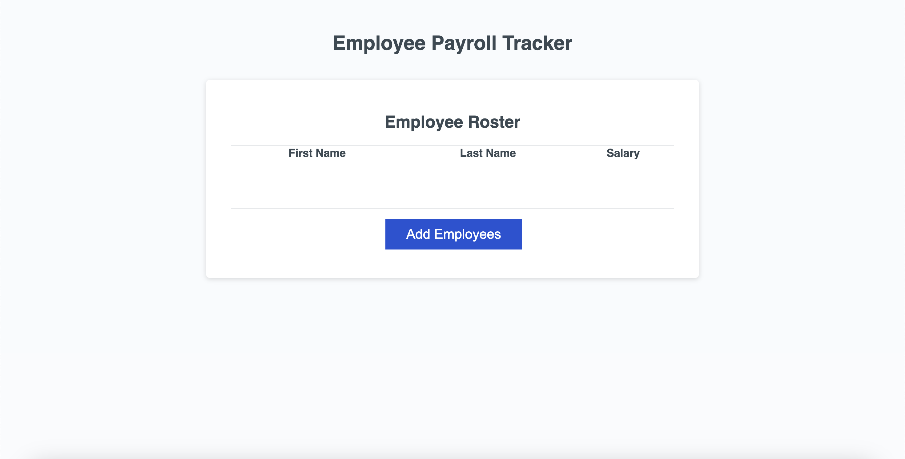

# challenge03-owen-kanzler

## Description

This is challenge 03 of the UMN Bootcamp. Here I completed the unfinished javascript code to make it so I can add employees and display them on the screen. I completed two other functions, one that finds the average salary of the different employees added, and another one that selects a random employee.

## Assets

## Usage

https://owenkanzler.github.io/challenge03-owen-kanzler/

## License

Please refer to the LICENSE in the repo.
